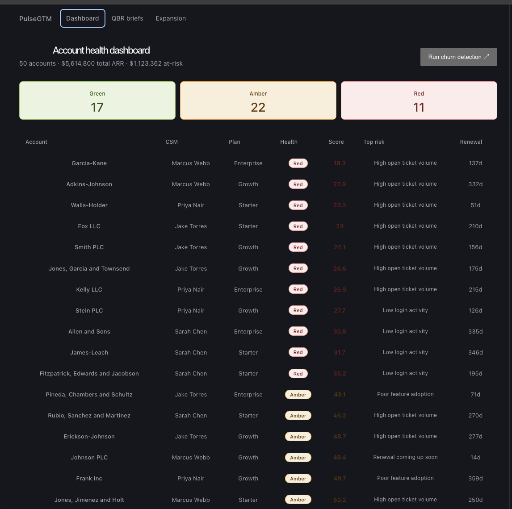
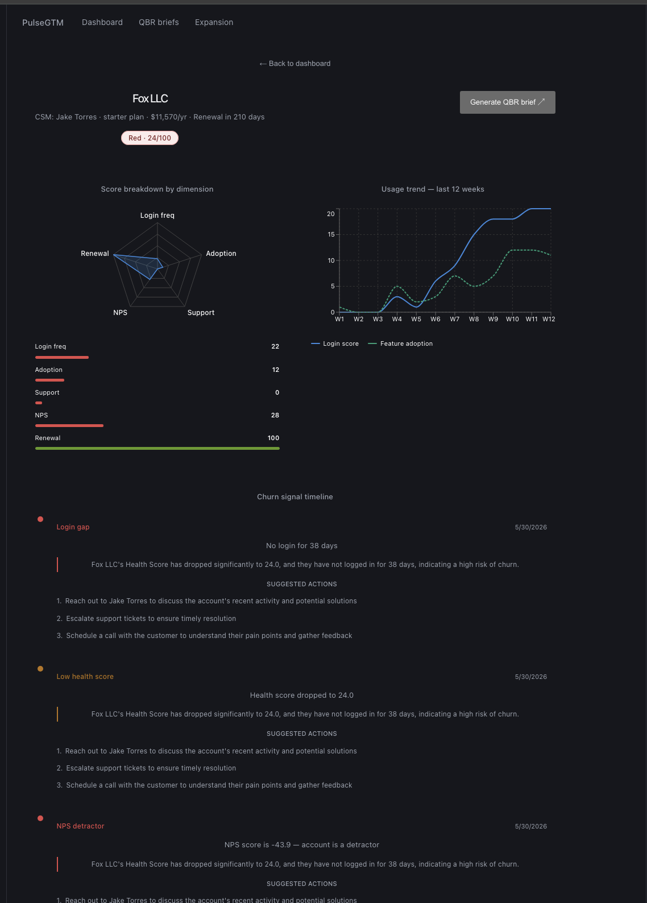
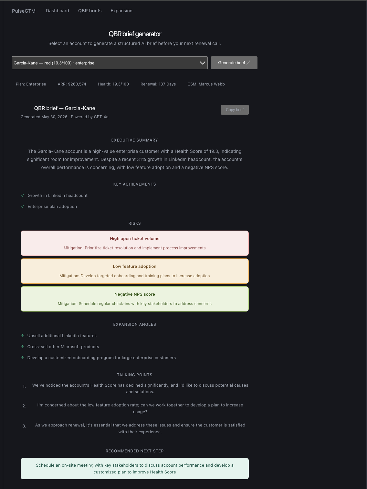
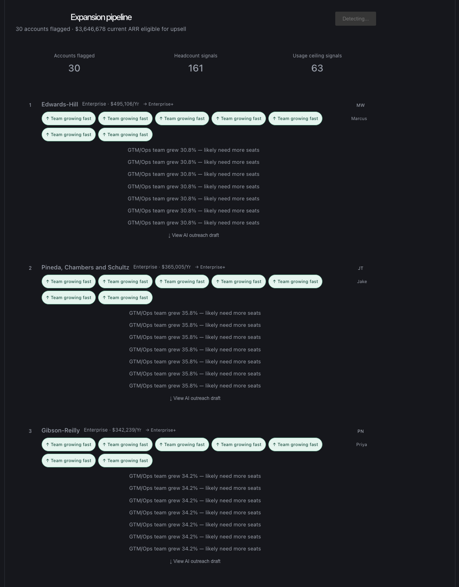

# PulseGTM Customer Health Command Center

> A Clay-native GTM automation platform that monitors customer health, detects churn signals early, identifies expansion opportunities, and generates AI-powered QBR briefs built for Customer Success teams at high-growth SaaS companies.

**[▶ Watch 2-min demo](docs/Demo-video.mp4)** 

---

## The Problem

Customer Success teams managing 40–50 accounts are flying blind.

They find out an account is about to churn when the customer emails to cancel. By then it's too late. Before every renewal call, CSMs spend 2–3 hours manually pulling data from Salesforce, product analytics, and support tools just to build a summary. And expansion opportunities? They only surface when the customer asks which is already reactive.

PulseGTM fixes all three problems in one pipeline.

---

## What It Does

| Problem | PulseGTM Solution |
|---|---|
| No early warning on churn | Health scoring engine monitors 5 signals per account, 24/7 |
| Manual QBR prep takes hours | One-click AI brief generated in 30 seconds |
| Expansion is reactive | Detects headcount growth + usage ceiling signals automatically |
| Alerts buried in dashboards | Proactive Slack alerts with AI summaries and next actions |
| Data siloed across tools | Clay enrichment pipeline feeds everything automatically |

---

## Built in 7 Days

| Day | What was built |
|-----|---------------|
| 1 | Data models, seed engine, health scoring model |
| 2 | FastAPI backend, all 11 endpoints, SQLite |
| 3 | React dashboard, account detail with Recharts |
| 4 | QBR brief generator (streaming), expansion pipeline |
| 5 | Clay enrichment table, ngrok webhook, Slack alerts |
| 6 | GitHub, deployment |
| 7 | README, demo video |

---

## Live Demo

### Dashboard — 50 accounts, $5.6M ARR tracked


### Account Detail — radar chart, usage trend, churn signal timeline


### QBR Brief Generator — AI brief in 30 seconds


### Expansion Pipeline — 30 accounts flagged, $3.6M eligible for upsell


**4 screens, all demoable:**

- **Dashboard** 50 accounts ranked by health risk, $5.6M ARR tracked, filter by red/amber/green
- **Account Detail** radar chart across 5 dimensions, 12-week usage trend, churn signal timeline
- **QBR Brief Generator** streaming AI brief in 30 seconds, copy to clipboard, regenerate
- **Expansion Pipeline** ranked upsell list by ARR, AI-drafted outreach per account

---

## Architecture

```
Clay (enrichment)
    ↓ webhook
FastAPI backend (Python)
    ↓ scoring engine
SQLite database
    ↓ signal detection
Ollama / GPT-4o (AI layer)
    ↓ brief generation + alert drafting
Slack (CSM alerts)
    ↑
React dashboard (frontend)
```

**The full pipeline is event-driven.** Add a company to the Clay table → webhook fires → account is scored → if health drops below threshold → Ollama generates risk summary → Slack alert fires to the CSM. Zero manual steps.

---

## Tech Stack

| Layer | Technology |
|---|---|
| Enrichment | Clay (LinkedIn headcount, firmographics, tech stack) |
| Backend | Python, FastAPI, SQLite, SQLAlchemy |
| AI | Llama 3.1 via Ollama (local) / GPT-4o (production) |
| Frontend | React, Recharts, React Router |
| Alerts | Slack Block Kit webhooks |
| Webhooks | ngrok (dev), Railway (prod) |

---

## Health Scoring Model

The scoring engine computes a **0–100 health score** per account using 5 weighted signals:

```python
WEIGHTS = {
    "login_frequency":  0.25,   # How often the team logs in
    "feature_adoption": 0.25,   # % of features actively used
    "support_tickets":  0.20,   # Open ticket volume
    "nps":              0.20,   # Net Promoter Score
    "days_to_renewal":  0.10,   # Renewal proximity pressure
}
```

Each signal is normalized to 0–100 before weighting. The weights are **configurable in the UI** a CSM lead can tune them without touching code.

**Health bands:**
- 🟢 Green: 70–100 healthy, monitor normally
- 🟡 Amber: 40–69 at risk, proactive outreach recommended
- 🔴 Red: 0–39 critical, immediate action required

---

## Churn Signal Detection

Four trigger conditions fire a Slack alert:

```python
CHURN_THRESHOLDS = {
    "login_gap_days": 14,           # No login for 2+ weeks
    "min_health_for_alert": 45,     # Health score below 45
    "nps_detractor_threshold": 0,   # NPS gone negative
    "ticket_spike_threshold": 4,    # 4+ open support tickets
}
```

Each alert includes:
- Account name, plan, ARR, CSM owner, renewal date
- AI-generated risk summary (2 sentences, plain English)
- 3 specific next actions for the CSM
- Urgency level (high / medium / low)

---

## QBR Brief Generator

One click before a renewal call generates a structured brief via GPT-4o / Llama 3.1:

```json
{
  "executive_summary": "...",
  "key_achievements": ["...", "...", "..."],
  "risks": [
    { "risk": "...", "severity": "high", "mitigation": "..." }
  ],
  "expansion_angles": ["...", "...", "..."],
  "talking_points": ["...", "...", "..."],
  "recommended_next_step": "..."
}
```

The frontend streams the response token-by-token using `ReadableStream` the CSM watches it generate live. Output is structured JSON so every section is consistent across accounts.

**The AI layer is model-agnostic.** Switch between Ollama and GPT-4o with one environment variable:
```bash
USE_OLLAMA=true   # Free, local, on-device
USE_OLLAMA=false  # GPT-4o, higher quality
```

---

## Expansion Detection

Two signals flag an account for upsell:

- **Headcount growth** LinkedIn team size grew 20%+ in GTM or ops departments (pulled via Clay enrichment)
- **Usage ceiling** Account is hitting limits on their current plan

Flagged accounts are ranked by current contract value. Each gets an AI-drafted outreach message warm, specific to the signal, ready to copy and send.

---

## API Endpoints

```
GET  /accounts                    All accounts with health scores
GET  /accounts/{id}               Single account detail
GET  /health/summary              Band counts + at-risk ARR
GET  /signals/churn               All fired churn signals
POST /signals/churn/run           Run churn detection + fire Slack alerts
POST /signals/expansion/run       Run expansion detection + generate outreach
POST /qbr/{account_id}            Generate QBR brief (standard)
POST /qbr/{account_id}/stream     Generate QBR brief (streaming)
GET  /signals/expansion           All expansion signals
POST /webhooks/clay               Receive enriched data from Clay
POST /dev/seed                    Seed 50 demo accounts
```

Full interactive docs at `http://localhost:8000/docs` (Swagger UI).

---

## Run Locally

### Prerequisites
- Python 3.11+
- Node 20+
- [Ollama](https://ollama.com) with `llama3.1` pulled
- Slack incoming webhook URL

### Backend

```bash
git clone https://github.com/rudrabrahmbhatt/pulsegtm.git
cd pulsegtm/backend

python3 -m venv venv
source venv/bin/activate
pip install fastapi uvicorn sqlalchemy pydantic openai requests python-dotenv faker

cp .env.example .env
# Fill in SLACK_WEBHOOK_URL

uvicorn main:app --reload
# API at http://localhost:8000
# Swagger UI at http://localhost:8000/docs

curl -X POST http://localhost:8000/dev/seed
```

### Frontend

```bash
cd pulsegtm/frontend
npm install
npm run dev
# Dashboard at http://localhost:5173
```

### Run the pipeline

```bash
# Fire churn detection + Slack alerts
curl -X POST http://localhost:8000/signals/churn/run

# Run expansion detection
curl -X POST http://localhost:8000/signals/expansion/run
```

---

## Environment Variables

```bash
USE_OLLAMA=true
OPENAI_API_KEY=sk-...           # Only if USE_OLLAMA=false
SLACK_WEBHOOK_URL=https://hooks.slack.com/services/...
CLAY_WEBHOOK_SECRET=your_secret
DATABASE_URL=sqlite:///./pulsegtm.db
```

---

## Product Discovery

This project started with user research, not code.

I mapped the CSM pre-call workflow and identified 3 core pain points across 3 user personas:

**Sarah (Senior CSM, 40 accounts)** "I only find out an account is at risk when they email me to cancel."

**Marcus (CSM Manager, $12M ARR)** "Every CSM on my team runs QBRs differently. The outcomes vary wildly."

**Priya (Enterprise CSM, 15 accounts)** "I want to walk into every call knowing more about their account than they do."

Every product decision the 5 signals, the Slack format, the JSON brief structure, the expansion ranking came from those conversations. Full discovery doc in `/docs/PRODUCT_DISCOVERY.md`.

---

## What I'd Build Next

- **Event-driven scoring** score updates the moment a ticket opens or login gap is detected, using Segment webhooks. Currently runs on-demand.
- **Gainsight / Vitally integration** push health scores directly into the CS platform CSMs already live in
- **Historical trend analysis** track score changes over time, not just current state
- **Multi-tenant support** one deployment serving multiple CS teams with isolated data

---

## Author

**Rudra Brahmbhatt** 

I build backend systems that hold up under real load. SentinelX: 300+ RPS, p99 under 200ms. SLAForge: 44 to 558 req/s, zero SLA breaches. PulseGTM brings that same instinct to GTM engineering: Clay pipelines, Python backend, AI automation, customer-facing product.

Open to GTM Engineer, RevOps Engineer, and ML Infrastructure roles in the United States.

[LinkedIn]((https://www.linkedin.com/in/rudra2122/)) 
